# End-to-end demo run report — October 9, 2026

The requested integration works on the live cluster: a SELinux outage automatically reaches an RCA, a Forgejo issue, an authenticated webhook, EDA/AO, and an Omnigent coding session. Human review and merge, followed by a human-launched AAP deployment, recovered the application with **SELinux Enforcing and HTTP 200** in both complete repeat runs.

We have not demonstrated the intended flow without intervention between session handoff and a tested PR. The two successful runs needed corrective agent messages, and one needed a stalled turn aborted and resumed. The final task incorporates those lessons, including explicit package names and a fact field, but has not been tested in another unattended run. The final human action also needs to become one deployment job with integrated Enforcing/HTTP verification; the measured procedure used separate deployment, enforcement, and verification commands.

Qwen currently delivers approximately **19–20 output tok/s with a short or reused prompt prefix**. A first 66,872-token synthetic request decoded at 16.3 tok/s and waited 31.35s for its first output. Reusing that large prefix with a different suffix reduced the observed first-output wait to 0.87s. These measurements favor controlling context growth and preserving prefix reuse before changing models or prescribing the fix.

## Scope and measurement rules

Live service URLs use an example hostname. Session, execution, tool-call, provider and Kubernetes object identifiers, plus syscall memory addresses, are replaced with consistent placeholders. The prompt appendix and evidence files use the same substitutions. Timings, token counts, diagnostic facts and public commit SHAs are preserved; the example links do not reach the live cluster.

This report covers the October 8 integration trials and the October 9 merge, reset/repeat, teardown/rebuild, and rebuilt incident. Older October 5 RCA-only rehearsals are excluded; they exercised an earlier stack and temporarily shortened alert timing. Fresh provider measurements were taken on October 9 at 08:23–08:31 UTC. No new outage, reset, merge, or deployment was performed while writing this report.

All times are wall clock in UTC. Incident timers start before `bash bootstrap/bootstrap.sh aap launch webapp_selinux_enable`, including its project/inventory refreshes. They end after the independent `webapp verify-enforcing` procedure succeeds. PR creation time comes from Forgejo’s timestamp. Human review, corrective prompts, retries, and operational recovery are included. These are **assisted validation timings**, not unattended benchmarks or latency guarantees.

The [additive critical path](evidence/2026-10-09/rebuilt-critical-path.json) sums exactly to 3,110 seconds. Individual AAP jobs and AO activities can overlap; their durations must not be added to that partition. Forgejo and Omnigent item timestamps have one-second resolution; AAP and AO retain subsecond timestamps. Raw bootstrap console logs lack per-line timestamps, so bootstrap stages are reported as observed milestones and bounded intervals.

The source implementation was GitOps branch `feature/forgejo-eda-remediation`, head `da594d06ff6841952a9816873145250731efa483`, based on `346b86bbd46bd101c1074c2ec482f57a1b4ff691`. The complete bootstrap retry succeeded on `26d696e60ca459c34c6b3b538102640b23639eed`. Later changes documented credential reconciliation and updated the agent task. Ansible/EDA implementation head was `dff2e17460a4d5c584b2bb236068fd279257fb95`, based on `3ad492812757a0560d8a03f79cd42d4c5e7888db`.

## What works and what remains

```mermaid
flowchart LR
    Human1[Human runs break playbook] --> Alert[WebappDown alert]
    Alert --> EDA1[EDA and AAP webhook job]
    EDA1 --> RCA[AO audit logs and Qwen RCA]
    RCA --> Issue[Forgejo incident]
    Issue --> Hook[Authenticated Forgejo webhook]
    Hook --> EDA2[New EDA listener and AO workflow]
    EDA2 --> Session[Backstage branch and Omnigent session]
    Session --> Agent[Agent investigates, fixes and tests]
    Agent --> PR[Fix PR]
    PR --> Human2[Human reviews and merges]
    Human2 --> Human3[Human launches AAP deployment]
    Human3 --> Verify[Independent Enforcing and HTTP proof]
```

| Intended stage | Evidence and current status | Remaining work |
|---|---|---|
| Human runs the break playbook | Seeded `webapp_selinux_enable` job switched the baseline VM to Enforcing; the origin returned 403/probe failure. | Keep a clear distinction between an intentionally permissive baseline and verified recovery. A merged fixed baseline must be reset before replaying the original fault. |
| Alert → RCA → Forgejo issue | Automatic in both complete runs. Actual AVC evidence identified `httpd_t` denied access to `/web/index.html` labeled `default_t`. | Improve RCA quality: its suggested `chcon` and optional network boolean were not sufficient evidence for a durable collection fix. |
| Webhook → EDA/AO → Omnigent | Automatic, authenticated, one session for each normal opening event. Backstage prepared the branch. | Duplicate delivery/session protection and bounded automatic recovery need explicit testing. Successful AO handoff does not mean a PR is ready. |
| Agent → tested fix PR | Completed with real lint, build, Molecule, and review evidence. | Prove zero corrective human messages after initial dispatch. Replace solution-specific prompt additions with reliable tools and documented environment requirements. |
| Human reviews and merges | Native Forgejo PRs were reviewed and explicitly merged under the requested test authorization. | This is the intended approval boundary, not an automation failure. Provide a compact evidence bundle tied to the tested head. |
| Human kicks off the fix job | Human-launched `webapp_nginx` deployed the merged collection. Additional enforcement and independent verification followed. | Provide one human-launched workflow/job that refreshes once, deploys the selected merged revision, and checks Enforcing plus HTTP. |
| Everything comes from bootstrap | Full non-AAP teardown/rebuild completed through `bootstrap/bootstrap.sh`; AAP and its database survived. | A fully uninterrupted cold run on the final revision has not been measured. One reader-password fix required restarting the measured bootstrap. |

No automatic merge or autonomous application-VM modification is needed to satisfy this design. Keep the human review/deployment boundary. The unproven autonomy is the segment **between session handoff and a validated PR**.

## Run totals

| Run or preparation phase | Start UTC | Finish UTC | Elapsed |
|---|---|---|---:|
| Existing agent fix: merge request → independent recovery proof | 00:34:48 | 00:40:59 | **6m 11s** |
| Demo reset, including API rollout recovery | 00:41:13 | 00:56:08 | **14m 55s** |
| Baseline bootstrap after reset | 00:56:08 | 01:11:55 | **15m 47s** |
| Successful repeat: break command → tested PR | 01:47:29 | 02:30:49 | **43m 20s** |
| Successful repeat: break command → final recovery proof | 01:47:29 | 02:51:21 | **1h 3m 52s** |
| Full non-AAP teardown | 02:52:13 | 02:57:41 | **5m 28s** |
| Rebuild, including credential fix and complete retry | 02:58:40 | 03:48:22 | **49m 42s** |
| Complete successful retry, included in rebuild total | 03:37:16 | 03:48:22 | **11m 06s** |
| Rebuilt incident: break command → tested PR | 03:48:44 | 04:30:24 | **41m 40s** |
| Rebuilt incident: break command → final recovery proof | 03:48:44 | 04:40:34 | **51m 50s** |
| Teardown start → rebuilt demo recovery proof | 02:52:13 | 04:40:34 | **1h 48m 21s** |

The 11m 06s retry reused applications, data, and the image installed by the initial attempt. It is not another cold-install benchmark. Earlier failed tuning trials and restoration between those trials are outside the two successful incident timers. See [run-timings.json](evidence/2026-10-09/run-timings.json).

### Initial merge and reset

The initial tested head `801aa25bfbd1219b2f56acd0cefbfb67a4c3d243` was merged at 00:34:49 as `3a3d5242fa5701f8bd3a427fb6e966fb79526dce`. The 6m 11s timer starts one second before the merge timestamp. Project update 130 took 52.493s; dependencies delayed nginx job 131 until 00:36:57. That job ran for 98.825s and finished at 00:38:35.874. Enforcement job 136 ran 00:40:18.914–00:40:28.527. Ad hoc command 142 returned Enforcing, and the final HTTP/monitoring check completed at 00:40:59.

The reset took 14m 55s, including a real API certificate/control-plane rollout interruption and manual resumption. The interruption marker is 00:55:12; recovery/reconciliation finished at 00:56:08. This marker records when the interruption was recorded, not when the API first became unavailable. No manual certificate replacement was performed. Baseline bootstrap then took 15m 47s; its final nginx job 183 took 118.839s. A healthy baseline at this point was deliberately permissive and must not be described as the merged fix working under Enforcing.

### Failed tuning trials before the successful repeat

The surviving EDA audit also records the October 8 integration alerts at 21:53:20.929 and 22:18:20.833, followed by the Forgejo dispatch rule at 22:22:05.326. Those records show the early integration runs, but the original session and complete incident body were removed during reset. The retained first fix diff and merge identity do not supply a complete original outage-to-PR timer, so none is claimed.

| Trial | Observed times | Result and change |
|---|---|---|
| First post-reset outage trial | Command 01:13:42; fault job 189 finished 01:14:29.360; EDA 01:16:20.728; RCA execution 01:17:00.638–01:20:05.512 | RCA failed with `AgentTimeoutError`. AO was still missing the no-thinking normalization already used by the native harness. Bootstrap gained the authenticated Qwen bridge. AO’s empty `tools: []` also required normalization because the backend rejected it. |
| Repeat notification trial | Command 01:33:06; fault command finished 01:34:09; no-delivery observation ended 01:45:44 | No new incident/session during the observed window. Recovery notifications were disabled and the notification group had a five-minute interval. Setup/reset also needed maintenance coverage. These were corrected. |
| Temporary repeat-interval experiment | Commit at 01:50:49; reverted at 01:51:17 | A five-minute repeat was briefly introduced, then reverted after checking that the relevant alert event predated the change. Final repeat interval remains one hour; group interval is 30s and resolved notifications are enabled. |

The initial credential restriction returned `401 key_model_access_denied` for `qwen38-27b`. The user changed the key’s access; later model listing and completion checks succeeded. This access change was a user/provider intervention before the measured successful runs, not a bootstrap entitlement change. The earlier native harness also encountered the provider’s idle timeout with thinking enabled; bootstrap now disables thinking for this demo alias in both native and AO paths.

### Successful repeat after reset

| Milestone | UTC | Elapsed from command |
|---|---|---:|
| Break command begins | 01:47:29 | 0 |
| Fault job 225 finishes | 01:48:18.504 | 49.5s |
| Alert EDA rule fires | 01:49:50.690 | 2m 21.7s |
| AO RCA execution begins | 01:50:31.369 | 3m 02.4s |
| Forgejo issue #2 created | 01:52:07 | 4m 38s |
| Forgejo EDA rule fires | 01:52:09.872 | 4m 40.9s |
| AO remediation begins | 01:52:47.672 | 5m 18.7s |
| AO session handoff completes | 01:53:34.913 | **6m 05.9s** |
| Tested PR #3 created | 02:30:49 | **43m 20s** |
| Human merge recorded | 02:32:31 | 45m 02s |
| Successful nginx job 273 finishes | 02:49:15.022 | 1h 1m 46s |
| Enforcement job 279 finishes | 02:51:07.424 | 1h 3m 38s |
| Independent verification ends | 02:51:21 | **1h 3m 52s** |

Before dependency caching was fixed, each incident-chain AAP job incurred roughly 30–33s from creation to execution, mostly SCM/inventory prerequisites: job 231 waited 33.075s, 237 waited 32.479s, 243 waited 30.484s, and 249 waited 30.307s. Their actual playbook execution was approximately seven or eight seconds each. This explains much of the slower first handoff.

The agent spent about **37m 14s from handoff completion to PR creation**. Review corrected module/return-field assumptions, dependency metadata, package/fact availability, and change reporting. The run included seven Molecule attempts; the retained validation record reports attempts 4–7 passing. Their full original session timeline and exact reviewer messages were not archived before teardown, so no precise per-attempt durations are claimed for this run.

The tested head `b2402158413b655e0cb0b6ac1744d19833f189b2` became squash commit `0ce1e3f59d09fd76d6c30344f0e4e8b254671852`. Deployment job 257 failed without executing its playbook because inventory dependency 259 failed; job 262 similarly failed on inventory dependency 264. Node disk pressure evicted execution pods. Manual cleanup of unused images at 02:37:46–02:37:48 recovered approximately 2 GiB; one image-removal request timed out. No running application volumes were removed. Storage readiness gating and serialized inventory refresh/cache handling were then implemented in bootstrap.

The successful deployment path began project update 268 at 02:47:01.331, completed nginx job 273 at 02:49:15.022, then used enforcement job 279 and independent command 280. The **18m 50s actual-merge-to-proof interval** includes failed launch dependencies, investigation, storage recovery, implementation changes, and the final retry. It is not nginx execution time.

The rebuilt run was **12m 02s shorter overall**, but agent handoff-to-PR time changed by only about six seconds: 37m 14s versus 37m 08s. Most of the improvement came from orchestration caching and avoiding the first repeat’s deployment/storage recovery, not a demonstrated improvement in autonomous coding performance.

### Teardown and cold rebuild preserving AAP

Teardown removed 18 non-AAP demo namespaces and their associated application/operator data in 5m 28s. AAP’s instance UID `REDACTED_AAP_INSTANCE_UID`, database PVC UID `REDACTED_AAP_DATABASE_PVC_UID`, and its bound PV remained the same before teardown, after teardown, and after rebuild. Demo EDA listeners were stopped until bootstrap reconfigured them. Shared cluster storage and workshop infrastructure were preserved.

| Rebuild milestone | UTC | Meaning |
|---|---|---|
| Bootstrap starts | 02:58:40 | Start of the 49m 42s measured rebuild. |
| Root GitOps Application created | 03:00:04 | Root GitOps Application exists. |
| CNPG Application created | 03:00:23 | Database operator requested; creation does not prove readiness. |
| Identity/monitoring Applications created | 03:01:19 | Next application wave requested. |
| Forgejo/RHDH/Pipelines/Virtualization Applications created | 03:02:54 | Operator/application rollout wave requested. |
| Starter Forgejo issue created | 03:03:54 | New repository and seed issue existed. |
| AO/Omnigent/AAP Applications created | 03:10:33 | Dependent application wave requested; AAP instance itself was preserved. |
| Homepage Application created | 03:14:12 | Final application wave requested. |
| Fresh sandbox image build | 03:15:06–03:17:53 | **2m 47s**, image digest `sha256:13c07796b0a867296b541b9a1e770981114ff21e39df872389d8e89c04ab93b6`. |
| First AAP project update 281 | 03:18:29.674–03:18:51.783 | 22.109s. |
| Node disk pressure clears | 03:22:52 | Bootstrap waited automatically; no manual image pruning during this rebuild. |
| AAP configure job 287 | 03:24:34.905–03:26:54.314 | 2m 19.410s, after project/inventory preparation. |
| VM provisioning job 297 | 03:30:19.634–03:31:12.997 | 53.363s. |
| Initial nginx job 303 | 03:33:12.009–03:35:22.353 | 2m 10.344s; healthy permissive baseline. |
| Initial attempt interrupted | 03:36:56 | Homepage AAP/EDA sources failed reader authentication/authorization. |
| Credential-reconciliation fix committed | 03:37:12 | Bootstrap now updates the retained AAP reader password to match the new Homepage secret. |
| Complete bootstrap retry starts | 03:37:16 | Reuses resources/image; not an independent cold-install test. |
| Retry configure job 310 | 03:42:02.067–03:44:06.281 | 2m 04.214s. |
| Retry VM job 320 | 03:45:59.582–03:46:08.636 | 9.054s, existing VM. |
| Retry nginx job 326 | 03:47:15.633–03:47:47.111 | 31.477s. |
| Complete bootstrap exits successfully | 03:48:22 | All six dashboard sources available; listeners running; baseline HTTP healthy. |

Application creation timestamps delimit rollout progress; they are not stage durations. The initial attempt ran **38m 16s** before interruption. The fix/restart gap was 20s, followed by an **11m 06s** complete retry. Those intervals sum to 49m 42s. Console logs show two automatic disk-readiness waits, but do not provide precise start/end timestamps for each wait.

## Rebuilt incident: detailed critical path

This is the strongest surviving record because the rebuilt AO execution and full Omnigent item stream remain available. Incident #2 fed session `REDACTED_OMNIGENT_SESSION_ID` using `demo/qwen38-27b` and the native OpenCode harness.

### Break command through session handoff

| Phase | Start UTC | End UTC | Wall time |
|---|---|---|---:|
| Break command and dependency refresh to fault-job completion | 03:48:44 | 03:49:45.431 | 61.431s |
| Fault complete → alert firing timestamp | 03:49:45.431 | 03:50:58.702 | 73.271s |
| Firing → EDA alert rule | 03:50:58.702 | 03:51:08.921 | 10.219s |
| EDA → AO RCA execution, through AAP webhook job | 03:51:08.921 | 03:51:17.294 | 8.373s |
| AO dispatch before audit activity | 03:51:17.294 | 03:51:17.963 | 0.668s |
| Audit activity, including AAP job 334 | 03:51:17.963 | 03:51:30.002 | 12.040s |
| Audit → model transition | 03:51:30.002 | 03:51:30.220 | 0.218s |
| Qwen RCA activity | 03:51:30.220 | 03:51:57.165 | 26.945s |
| Model → issue transition | 03:51:57.165 | 03:51:57.492 | 0.327s |
| Create-issue activity → Forgejo creation timestamp | 03:51:57.492 | 03:52:07 | 9.508s |
| Issue → Forgejo EDA rule | 03:52:07 | 03:52:08.532 | 1.532s |
| Forgejo EDA → AO remediation, through AAP webhook job | 03:52:08.532 | 03:52:18.265 | 9.734s |
| AO dispatch before Backstage | 03:52:18.265 | 03:52:18.675 | 0.410s |
| Backstage prepares branch | 03:52:18.675 | 03:52:21.981 | 3.306s |
| Prepare → authentication transition | 03:52:21.981 | 03:52:22.113 | 0.132s |
| Omnigent machine-token acquisition | 03:52:22.113 | 03:52:22.184 | 0.071s |
| Authentication → session transition | 03:52:22.184 | 03:52:22.237 | 0.053s |
| Session creation HTTP request | 03:52:22.237 | 03:52:23.282 | 1.045s |
| Session → task transition, with sharing activity | 03:52:23.282 | 03:52:23.637 | 0.356s |
| Send-task request, including sandbox readiness/retries | 03:52:23.637 | 03:53:13.487 | 49.850s |
| Handoff completion bookkeeping | 03:53:13.487 | 03:53:15.805 | 2.318s |

Total command-to-handoff time was **4m 31.805s**. From fault-job completion to handoff it was **3m 30.375s**. The initial user message was stored at 03:53:15. Exact webhook ingress arrival and sandbox scheduling/image-pull/startup subspans were not retained, so the 49.850s send-task envelope cannot be attributed entirely to image startup.

Fault job 332 itself executed for only **8.424s**. The preceding project update took 9.613s; inventory updates took 13.535s and 16.259s, with additional nested project updates. The alert uses a 30s scrape interval, a one-minute hold, and a 10s Alertmanager group wait. The observed 73s from fault completion to firing is consistent with that configured detection path.

At this stage the cached incident-chain AAP jobs waited under 0.6s from creation to execution: 333 waited 0.424s, 334 0.460s, 335 0.472s, and 336 0.539s. Their runtime remained roughly eight or nine seconds. Caching improved the orchestration path; it did not materially reduce the agent’s subsequent time to PR.

### Agent work, corrective prompts, and tests

All four session user messages are reproduced in [the prompt appendix](2026-10-09-demo-prompts.md) and [session-user-prompts.json](evidence/2026-10-09/session-user-prompts.json), with the privacy substitutions described above. There was one automatic task plus **three manual messages**. Those messages changed the outcome and must count as interventions.

| Agent milestone | UTC or interval | Duration / result |
|---|---|---|
| Automatic task delivered | 03:53:15 | Read incident, checkout, AGENTS, and collection. |
| Initial investigation and candidate before first reviewer message | 03:53:15–04:06:24 | **13m 09s**; wrong module-location guesses, incorrect packages, misplaced lint scope, and unsupported assumptions. |
| Incorrect lint pipeline | 03:58:45–03:58:48 | 3s; `head` followed by `$?` falsely printed `EXIT=0` despite lint failure. |
| Repository lint with temporary collection path | 04:00:53–04:01:04 | 11s; actual `EXIT=2`. |
| First prolonged `/tmp` lint | 04:02:30–04:04:31 | **2m 01s**, timed out. |
| Second prolonged `/tmp` lint | 04:05:36–04:10:04 | **4m 28s**, stopped by manual native-session abort. |
| First reviewer correction | 04:06:24 | Correct working directory/exit handling, production/test dependencies, modern packages, binding/fact order, restorecon reporting, compatibility. Queued while the native turn remained busy. |
| Resume message after abort | 04:10:05 | Continued the same session/workspace; no separate incident dispatch. |
| Dependency installation | 04:11:13–04:13:35 | **2m 22s** after an earlier unsuccessful install invocation. |
| Scoped repository lint | 04:13:50–04:14:01 | 11s; `EXIT=0`, production profile. |
| Collection build | 04:14:06–04:14:07 | 1s; `EXIT=0`. |
| Molecule attempt 1 | 04:14:19–04:16:08 | **1m 49s**, exit 2: unsupported `ansible_facts.selinux.policy`. |
| Lint/build rerun | 04:16:28–04:16:39 | Lint 0; build 1 because the old tarball existed. |
| Forced rebuild | 04:16:44–04:16:45 | 1s; build 0. |
| Molecule attempt 2 | 04:16:51–04:18:43 | **1m 52s**, exit 2: same unsupported fact; no effective correction before rerun. |
| Fact correction from reviewer | 04:19:37 | Directed verification against the installed fact collector, which returns `selinux.type`, not `selinux.policy`. |
| Corrected lint/build | 04:20:39–04:20:51 | 12s; both exit 0. |
| Molecule attempt 3 | 04:20:57–04:21:11 | **14s**, exit 2: test process fell back to `kubernetes.default.svc`; connection refused during create/destroy. |
| Environment diagnosis | 04:21:11–04:23:58 | **2m 47s**; original scoped credential remained valid, later simple invocation used the intended environment. |
| Molecule attempt 4 | 04:23:58–04:26:27 | **2m 29s**, exit 0; complete lifecycle and cleanup. |
| Read validation evidence and commit | 04:26:27–04:27:09 | 42s; tested head `8617480ece1661388b2278c43c4ed452dc33e52b`. |
| Commit → PR creation | 04:27:09–04:30:24 | **3m 15s**; evidence inspection, PR-body drafting, one denied `/tmp/opencode` write, then submission. |
| Ordinary `git push` in final command | 04:30:23 | Failed with missing HTTP credentials, `PUSH_EXIT=128`. The subsequent `demo-goldenpath pr` used managed credentials, pushed successfully, and created the PR. |
| PR created | 04:30:24 | **41m 40s from break command**, **37m 09s from initial task**. |

The four actual `molecule test -s nginx` envelopes total **6m 24s**, including failed attempts. The final complete test took only 2m 29s. Recorded tool call/output envelopes account for **19m 50s** of session activity, including 6m 29s in the two prolonged lint calls and 2m 22s in the long dependency install. Remaining gaps include model generation, harness/orchestration work, and review/diagnosis; there are no retained per-inference spans to attribute them precisely. Tool timestamps are client/session records, not server GPU metrics.

There were **112 function calls**: 77 bash, 11 webfetch, 9 edit, 9 write, 3 todo, 2 read, and 1 glob. Eleven web fetches included seven 404/401 errors while the model guessed module locations or attempted unauthenticated GitHub search. Locally installed module documentation would have supplied version-correct information without those guesses. Tool-call count is not the number of model requests; one model response can contain multiple calls.

Run 3 exposed a real process-environment failure, not evidence that the scoped Kubernetes identity lacked VM permissions. A namespace-level `get` was forbidden as expected for this scoped identity. The final test succeeded using the original profile and credential. Its full process environment at failure time was not archived, so the exact inheritance mechanism is not proven. The PR initially overstated this as an intermittent cluster outage; the human reviewer corrected that limitation before merge.

The agent ultimately made a persistent file-context fix, installed current bindings before refreshing facts, declared production collection dependencies, and added an Enforcing/HTTP regression. Lint and build passed; all eight applicable Molecule lifecycle stages passed; idempotence changed zero tasks; all 12 installed role files matched the tested workspace; and no test VM/VMI/PVC remained. The default scenario and shared provisioners were preserved. Human review read all seven changed files at the tested head before approving the merge.

### Human merge, deployment, and final proof

| Phase | UTC interval | Wall time |
|---|---|---:|
| PR creation → merge request start | 04:30:24–04:31:59 | **1m 35s** |
| Forgejo records merge | 04:32:00 | One second after request start. |
| Merge request → nginx job starts | 04:31:59–04:35:53.057 | **3m 54.057s** |
| nginx job 342 executes | 04:35:53.057–04:36:32.567 | **39.510s** |
| nginx complete → enforcement job starts | 04:36:32.567–04:39:59.128 | **3m 26.561s** |
| Enforcement job 348 executes | 04:39:59.128–04:40:10.351 | **11.223s** |
| Enforcement complete → independent verification complete | 04:40:10.351–04:40:34 | **23.649s** |
| Merge request → verified recovery | 04:31:59–04:40:34 | **8m 35s** |

The six project updates below fetched collections repeatedly during this phase. Inventory updates triggered additional project updates even after an explicit refresh. The fetch tasks lie within the critical path; their measured sum was **341.091s, or 5m 41.091s**, approximately **66.2% of the merge-to-proof interval**.

| Project update | Collection-fetch time | Total project-update runtime |
|---|---:|---:|
| 337, explicit deployment refresh | 74.950s | 78.595s |
| 339, nested inventory prerequisite | 52.618s | 57.735s |
| 341, nested inventory prerequisite | 58.012s | 62.918s |
| 343, explicit enforcement refresh | 57.340s | 61.293s |
| 345, nested inventory prerequisite | 57.272s | 62.319s |
| 347, nested inventory prerequisite | 40.899s | 46.231s |

AAP job 342 relabeled `/web` and `/web/index.html` from `default_t` to `httpd_sys_content_t` and returned guest HTTP 200. The application playbook still has a pre-task setting Permissive for the baseline; the rebuilt agent’s role switches back to Enforcing. The additional enforcement job and independent ad hoc command 349 established final Enforcing/rc=0, and the origin blackbox probe returned HTTP 200/probe_success=1. Public anonymous ingress correctly redirects through OIDC; a 302 there is not an origin failure. Final `WebappDown` was inactive.

The final native squash commit was `18b32c93291647ee05d28442e878baf3487da364`. AAP’s `scm_revision` points to the orchestration project, not the collection commit; its value alone cannot prove which fix was deployed. The current evidence proves role behavior and the tested/merged head, but a future deployment evidence bundle should explicitly record the loaded application collection revision or artifact digest.

## Qwen provider performance

### Measured throughput

Five serial streaming requests went from this workspace directly to the configured LiteLLM provider. Each requested 256 output tokens, `temperature=0`, thinking disabled, and streaming usage. The first two prompts were short. Later prompts prefixed synthetic AVC text to emulate larger input sizes. These probes do not reproduce native tool schemas, real incident complexity, production load, or GPU concurrency. The provider reported LiteLLM 1.81.0; the actual rebuilt AO RCA response reported backend fingerprint `vllm-0.30.0-tp2-REDACTED_INSTANCE`. GPU type and capacity were not inspected.

| Sample | Input tokens | Output tokens | First-output wait | Full request | Approx. decode tok/s | Output / full-request tok/s |
|---|---:|---:|---:|---:|---:|---:|
| Short 1 | 56 | 256 | 0.459s | 13.435s | **19.68** | 19.06 |
| Short 2 | 60 | 256 | 0.478s | 13.460s | **19.67** | 19.02 |
| Synthetic audit context | 8,408 | 256 | 4.470s | 17.783s | **19.18** | 14.40 |
| First agent-scale context | 66,872 | 256 | **31.351s** | 47.039s | **16.27** | **5.44** |
| Same agent-scale prefix, different suffix | 66,876 | 256 | **0.871s** | 13.378s | **20.42** | 19.14 |

Decode approximation is `(completion_tokens - 1) / (last_content_chunk_time - first_content_chunk_time)`. Full-request throughput is `completion_tokens / elapsed_request_seconds`. All five samples delivered 256 content events and reported zero reasoning tokens. Client buffering, network, proxy, and scheduling still affect the measurements. The first-output wait is measured at the client, not an isolated server prefill duration. This distinction follows [vLLM’s latency definitions](https://docs.vllm.ai/en/latest/design/metrics/) and [LiteLLM’s streaming usage interface](https://docs.litellm.ai/docs/completion/usage).

The repeated-prefix request had a changed suffix, so it was not an identical whole-request response-cache test. Its roughly **30.48s reduction in first-output wait** strongly supports prefix reuse as a useful path to investigate. One pair of samples cannot prove cache configuration, routing affinity, or sustained hit rate. Server KV-cache and scheduling metrics were unavailable. [vLLM’s prefix-caching documentation](https://docs.vllm.ai/en/latest/features/automatic_prefix_caching/) describes reusing prefix work to reduce prefill; it does not make output decoding faster by itself.

The historical measurements cover different parts of the workflow:

| Historical measurement | Counts and span | Interpretation |
|---|---|---|
| Saved direct RCA-shaped bridge check | 3,855 input; 272 output; 12.684110s | **21.44 output tok/s** over the whole request. No saved first-token timestamp. |
| Actual rebuilt AO RCA node | 3,918 input; 176 output; 26.945399s | **6.53 output tok/s** over the activity envelope, including AO/bridge/model orchestration. Not decode speed. |
| Rebuilt coding session | 4,163,249 cumulative input; 17,981 output | Native session counters across the entire conversation, including repeated input contexts. Not one request or one prompt. |

The coding session’s last recorded context count was **69,866 tokens**. Reported cache-read input tokens were zero, but that does **not** prove provider prefix caching was disabled; the warm-prefix observation shows why a missing/zero accounting field should not be used that way. Reported cost was $0; pricing was not independently verified, so this is not proof that inference was free.

Dividing 17,981 output tokens by the **37m 39s initial-task-to-final-session-update interval** (03:53:15–04:30:54) gives an approximately **7.96 tok/s conversation-level rate**. It includes output after PR creation, tests, shell commands, manual review, and stalled tools and must not be presented as provider decode performance. See [qwen-throughput.json](evidence/2026-10-09/qwen-throughput.json), [session-usage.json](evidence/2026-10-09/session-usage.json), and [ao-activities.json](evidence/2026-10-09/ao-activities.json).

## Problems, interventions, and their status

| Problem | Effect | Intervention / current status |
|---|---|---|
| Model key initially denied Qwen | Work could not begin on the requested model. | User/provider changed access; subsequent checks and completions passed. |
| Thinking exceeded provider idle limit | Native and AO turns timed out before useful output. | Bootstrap configures no-thinking for this demo alias; no timeout tuning alone was treated as a fix. |
| AO sent empty tool list to backend | RCA request rejected. | Qwen bridge strips an empty tool list and its related control fields, retaining real tools when present. |
| Setup alerts and muted recovery | False setup incidents or suppressed repeat delivery. | Bootstrap maintenance coverage, resolved notifications, 30s group interval, firing-only EDA filters; hourly repeats retained. |
| Invented module/package/fact/return fields | Incorrect code or repeated failed tests. | Manual review; final prompt now names verified packages and `selinux.type`. This is solution-specific guidance, not a demonstrated general capability. |
| `/tmp` lint and temporary collection paths | Wrong validation scope, missing dependencies, long scans. | Manual review plus abort/resume. Final task names the proper scope; no hard enforcement in the tool layer was added. |
| Pipeline masked exit status | Printed success for a failed lint command. | Reviewer caught it; agent switched to real exit-code checks. PR validation was independently inspected. |
| Duplicate collection build output | Build exited 1 on existing tarball. | Agent forced rebuild; final build passed. |
| Repeated test without effective code correction | Same unsupported fact failed twice. | Reviewer supplied collector evidence; corrected test passed later. |
| Test subprocess lost intended Kubernetes endpoint | Molecule create/destroy failed in 14s. | Agent diagnosed environment and retried successfully with original scoped credential. Exact inheritance failure remains unproven. |
| Node disk pressure / inventory pod eviction | Two deployment jobs never ran; first repeat extended substantially. | Manual unused-image prune; bootstrap now gates on storage readiness and serializes refreshes. It does not automatically prune caches. |
| New Homepage secret vs preserved AAP reader | Cold bootstrap stalled with AAP 401/EDA 403 sources. | Manual code fix and complete bootstrap restart; password reconciliation now lives in bootstrap. |
| API rollout interrupted reset | Reset needed resumption. | Waited for cluster recovery and resumed reconciliations. |
| PR-body file outside tool-writable area | One write was denied. | Agent moved it outside the repo but inside its workspace. |
| Plain HTTP git push lacked credentials | `PUSH_EXIT=128`. | Managed `demo-goldenpath pr` successfully pushed/submitted; ordinary push is not a reliable supported path here. |
| PR described test setup as a cluster outage | Misleading limitation in submitted narrative. | Human edited the PR body before merge to reflect scoped-identity evidence. |
| Duplicate webhook delivery not deduplicated | Can create duplicate sessions or repeated task messages. | Normal opening-event tests produced one session; duplicate/redelivery behavior is not a passed acceptance test. |
| Final task/bootstrap not benchmarked unattended | Improvements cannot yet establish the desired reliability claim. | An unattended run remains untested. |

The intended human merge and job launch are separate from corrective interventions. The automatic incident handoff received no manual dispatch. Root/operator code changes, review messages, reset resumption, cache pruning, bootstrap restart, and native abort/resume were manual work and are not hidden from the elapsed totals.

## Improvements that preserve agent investigation

Making the execution environment and validation evidence dependable offers the largest improvement. Adding increasingly specific repair steps to the prompt produced an assisted success, but does not demonstrate that the next unrelated incident will be solved. The final prompt now explicitly specifies packages, a fact field, and restorecon reporting; the next evaluation should replace those hints with required outcomes and measure whether the tools let the agent discover the implementation.

| Priority | Change to evaluate | Evidence and likely benefit | Verification needed |
|---|---|---|---|
| 1 | A canonical repository validation tool, with enforced cwd, collection paths, exit capture, unique/forced build output, logs as artifacts, and compact error summaries | Targets the two prolonged lint calls totaling **6m 29s**, the false exit result, tarball collision, and multiple scope/path mistakes. It defines how to test, not how to fix SELinux. | Run the deliberately broken baseline; prove the tool reports the relevant failure and never success from a failed pipeline. Run the final fix; prove all existing assertions and cleanup still execute. |
| 1 | Reliable sandbox process environment and automatic test preflight | Provide the scoped kubeconfig to every subprocess, verify the DataSource and exact allowed VM operations, ensure tools/dependencies are ready, and acquire a test lease. Targets the run-3 failure and **2m 47s** of diagnosis. | Remove/reset incidental shell state and rerun the tool. Prove it uses the intended scoped identity and needs no admin credentials. |
| 1 | Bounded tool execution with automatic stall recovery in the same session | A queued reviewer message could not interrupt a stuck turn; long `/tmp` scans consumed **6m 29s**. Watch process/output progress, terminate the owned command, retain evidence, and return a structured timeout to the agent. | Inject a hanging harmless command; verify termination, preserved workspace, one continuation, bounded retries, and an explicit failure record. |
| 1 | Install pinned test tooling and expose local documentation/fact discovery as tools | The long install took **2m 22s**; 11 web fetches included seven HTTP failures. Serve installed `ansible-doc` JSON, collection versions, package-manager queries, and actual `setup` facts as evidence. | Use an unfamiliar supported module/fact without naming its parameters in the task; the agent should inspect the installed contract. Ensure changed production dependencies remain declared and resolved, not hidden by the image. |
| 2 | Keep stable prompt/tool prefixes; reduce repeated log/doc dumps; compact context at a measured threshold | Session accumulated **4.16M input tokens**, with a last context near 70k. Synthetic prefix reuse reduced first-output wait by **30.48s**; cold long-context latency was material. Store full logs externally and return targeted errors/artifact references. | Record per-request input/output/cache counts, TTFT, backend routing and prefix-cache hits. Compare unchanged task quality and pass rate at selected context thresholds. Verify summaries preserve evidence, constraints, and exact tested revisions. |
| 2 | Refresh the deployment project/dependencies once, reuse for inventory updates, and pin the merged collection artifact | Six fetch tasks consumed **5m 41s** of an **8m 35s** phase. This is a direct delivery bottleneck independent of agent reasoning. | Verify the loaded collection matches the merged/tested SHA or artifact digest. Test stale-cache behavior after a new merge. Reusing stale `main` dependencies would be a correctness regression. |
| 2 | One human-launched deploy-and-verify workflow | Avoid the second complete refresh before enforcement; include actual Enforcing plus origin HTTP assertions in the approved deployment. The baseline playbook currently sets Permissive unconditionally. | Keep baseline preparation explicitly separate from recovery behavior. A failed Enforcing or HTTP check must fail the deployment result. No automatic PR merge. |
| 2 | Deduplicate by repository, issue, event/delivery and workflow/session state | Current success only covers normal delivery; retries of session creation/task POSTs can produce duplicates after uncertain outcomes. | Redeliver the same opening event, simulate timeout after accepted POST, and ensure one session/task while allowing a genuinely new incident. Persist the mapping across restart. |
| 2 | Evidence-oriented RCA, with diagnostic hypotheses separated from proposed changes | RCA correctly recognized labeling but proposed `chcon` and a network boolean without proof. Supply relevant AVCs, process/file context, actual mode, recent change, and HTTP symptom. Prefer facts and confidence to a repair recipe. | Test multiple causes including non-SELinux failures. Verify the coding agent checks the hypothesis instead of copying unsafe or transient actions. |
| 3 | Maintain capacity headroom and warm only necessary sandbox/image/test prerequisites | SNO has roughly 32 CPUs, 130 GiB RAM, and a 100 GiB node filesystem; image churn caused disk pressure. Handoff includes a **49.850s** send-task envelope. | Measure scheduling, pull, init and readiness separately before selecting prewarming. Monitor free bytes/inodes and reserve headroom; retain an honest cold-bootstrap benchmark. |
| 3 | Make every setup/run emit a timestamped, credential-free evidence bundle before reset | Earlier session prompts and per-test spans were lost at teardown; untimestamped console logs limit bootstrap attribution. | Bundle phase timestamps, task/template hashes, issue/delivery/session IDs, per-inference usage, test results, merge SHA and deployment provenance. All procedural bootstrap/reset/teardown changes belong in `bootstrap/bootstrap.sh`. |

These benefits overlap and must not be added as a promised time saving. Fixing a validation wrapper could eliminate both wasted lint scans and follow-up model turns; context reduction affects the same session interval. Likewise one deploy workflow and deduplicated dependency refresh address overlapping delivery time.

A suitable future agent task would state the objective and constraints rather than the package/fact answer:

> Investigate the linked incident and treat its RCA as a hypothesis. Reproduce the failure using the existing isolated test scenario. Implement the smallest durable collection change that restores HTTP service with SELinux Enforcing. Use the available documentation and runtime evidence tools to verify your assumptions. Run the repository validation tool, resolve failures, and submit a PR with the tested commit, artifact links, and remaining limitations. Do not modify the application VM or merge the PR.

The platform should supply the checkout, supported commands, installed versions, credential scope, and actual evidence. It should enforce test execution and failure reporting. The agent should still decide which collection code needs to change and why.

## Tests needed to demonstrate the intended flow

1. Freeze a bootstrap commit and a task stating the required outcomes without the explicit package/fact-field solution. Capture hashes before running.
2. Recreate the intentionally vulnerable baseline through the existing reset/bootstrap path. Verify that it is healthy, record its permissive mode, and confirm listeners are ready.
3. Run the seeded break job once. After dispatch, allow **no corrective prompts, manual session restart, package installs, code edits, environment fixes, or manual webhook replay**. Automatically archive timeout/failure evidence if the agent cannot finish.
4. Count success only after a PR has independently verified lint, build, the actual isolated regression, idempotence, cleanup, and the tested commit. A completed AO workflow is insufficient.
5. Have the human review and merge the exact tested head, then launch the single recovery workflow. Require loaded-revision evidence, guest Enforcing, origin HTTP 200, and alert resolution.
6. Repeat at least three independent incidents, including one with a different cause and one duplicate delivery. Publish assisted and unattended results separately, with median/range and failure categories. Three passes are a useful initial acceptance sample, not a reliability probability estimate.
7. Run one uninterrupted non-AAP teardown/full bootstrap on the frozen final revision and report that cold timing separately from retry timing.

No defensible unattended completion-time target can be inferred from two assisted runs. A useful first target is to remove corrective interventions and show one approximately 2m 29s successful Molecule lifecycle, rather than repeated failing attempts. Shorter alert timers might save tens of seconds but change detection semantics; they are lower priority than the multi-minute tool, context, and deployment overhead.

## Final evidence, prompts, and limitations

The full prompt and incident text is in [2026-10-09-demo-prompts.md](2026-10-09-demo-prompts.md): registered agent prompt, collection AGENTS instructions, RCA template and expanded actual request, all four rebuilt session user messages, initial/repeat/rebuilt/final task-template revisions, both incident bodies, and the synthetic benchmark prompts. The earlier repeat’s exact manual messages and full provider system prompts were not retained; the report identifies those missing records.

Published, credential-free records:

- [Overall run clocks](evidence/2026-10-09/run-timings.json) and [additive rebuilt critical path](evidence/2026-10-09/rebuilt-critical-path.json).
- [AAP job metadata](evidence/2026-10-09/aap-jobs.json), [collection-fetch task spans](evidence/2026-10-09/collection-fetches.json), and [AO/EDA timing and RCA usage](evidence/2026-10-09/ao-activities.json).
- [Native tool envelopes](evidence/2026-10-09/agent-tools.json), [all retained user messages](evidence/2026-10-09/session-user-prompts.json), [session usage](evidence/2026-10-09/session-usage.json), [provider samples](evidence/2026-10-09/qwen-throughput.json), and [incident/fix identities](evidence/2026-10-09/issues.json).
- [Final functional validation and preserved AAP identities](evidence/2026-10-09/final-validation.json), and [preparation/trial clocks and image build](evidence/2026-10-09/preparation-and-trials.json).

Supporting local validation artifacts remain under `.rendered/end-to-end-20261009/`, including console logs, exact final diffs, PR reviews, Molecule/load-path verification, live relabel tasks, independent Enforcing/HTTP/alert checks, and AAP before/after identities. That directory is intentionally ignored. The published JSON selects timing and prompt evidence without authentication headers, tokens, private keys, or kubeconfig contents.

At completion of the rebuilt run, all 15 GitOps Applications were Synced/Healthy, both EDA listeners were running, all six dashboard sources were available, and no Molecule VM/VMI/PVC remained. A fresh read during this report still found all 15 Applications Synced/Healthy. The 04:40:34 guest-mode/HTTP proof is the benchmark’s final verification; it was not re-created during report preparation. The idle sandbox has since been removed, so native process-level inference spans cannot now be recovered from its runtime.

GitOps implementation [PR #40](https://github.com/aiops-ansible-software-factory-demojam/openshift-gitops/pull/40) and Ansible/EDA implementation [PR #3](https://github.com/aiops-ansible-software-factory-demojam/demojam-ansible/pull/3) remain for human merge review. The native Forgejo [fix PR #3](https://forgejo.demo.example/demo-owner/ansible-collection-demo.webapp/pulls/3) was merged under the test authorization. Forgejo issue/PR numbers were reused after reset/reseed, so their URLs alone do not distinguish runs; the archived timestamps and commit SHAs do.

The implementation’s final Bash syntax, warning-level ShellCheck, webhook/credential regression scripts, targeted manifest renders, and whitespace checks passed in the prior validation. No GitHub CI is configured. This reporting change does not change bootstrap logic, workflow configuration, the cluster, or the repair code. The suggested changes have not been implemented or tested.
